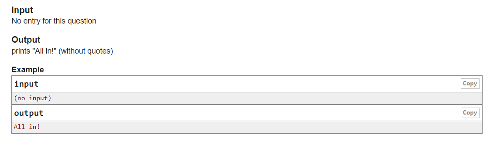

<h1 align="center">1. All In</h1>

    Time limit per test: 1 second
    Memory limit per test: 256 megabytes
    Input: standard input
    Output: standard output

<b>Texas Hold'em</b> is a traditional event held by ZUCCACM Lab every year during team building. In each round, each player is given two hole cards face down, each without knowing what the other's hole card is. Then five community cards are dealt on the field, and then each player shows their cards individually, using their two hole cards to match with the five community cards on the field (five out of seven) to obtain the best five-card combination, the one with the largest card Player Authority wins.

Since the laboratory recruits many freshmen every year, someone needs to teach the freshmen how to play Texas Hold'em, but unfortunately, this year's poker teacher ZAwei is not good at playing poker either. He taught all freshmen to print "All in!" (without the quotes) no matter what card they got.

