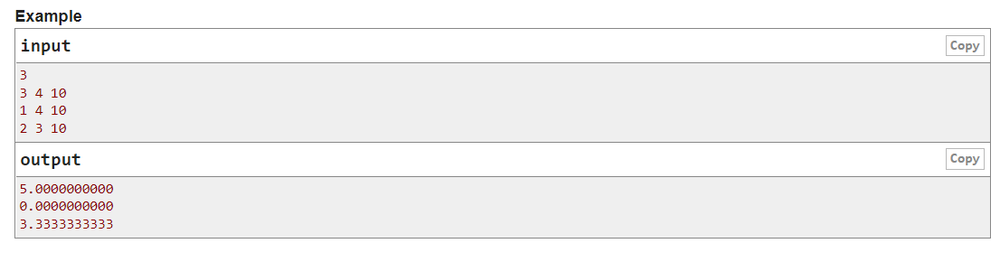

<h1 align="center">2. Boboge and Tall Building</h1>

    Time limit per test: 1 second
    Memory limit per test: 256 megabytes
    Input: standard input
    Output: standard output

<b>Boboge</b> lives on the n-th floor of a building with a total height of k. This building has m floors and each floor is of equal height, the height of first floor is 0.

You have to calculate the height of the floor <b>Boboge</b> lives in.

<h5>Input</h5>

The first line contains an integer $t(1≤t≤100)$ — the number of test cases.

Each test case is described by three integers $n,m,k(1≤n,m,k≤100,n≤m)$ — the floor <b>Boboge</b> lives in, number of total floors and total height of the building.

<h5>Output</h5>

For each test case, output the height of the floor <b>Boboge</b> lives in. Your answer will be accepted if absolute or relative error does not exceed $10^{-6}$. Formally, let your answer be $a$, and the jury's answer be $b$. Your answer is considered correct if $\frac{|a−b|}{max(1,|b|)}≤10^{-6}$.

